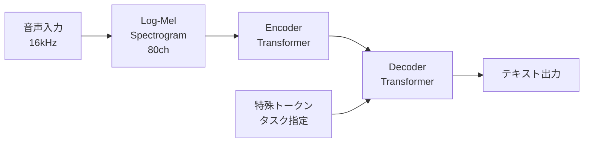

# Whisper: Robust Speech Recognition via Large-Scale Weak Supervision

**発表日:** 2025-04-18
**発表者:** （担当者名）
**論文:** [arXiv:2212.04356](https://arxiv.org/abs/2212.04356)
**著者:** Alec Radford, Jong Wook Kim, et al. (OpenAI, 2022)

---

## スライド

- [スライド (HTML)](slides.html)
- [スライド (PDF)](slides.pdf)

---

## 概要

Whisper は、インターネット上から収集した **68万時間** の音声データを用いて弱教師あり学習で訓練された音声認識モデル。
多言語・多タスク（転写・翻訳）に対応し、ゼロショットで既存モデルに匹敵する性能を達成した。

---

## 主要ポイント

1. **大規模弱教師あり学習** — ラベルなし音声ではなく、Web から収集した音声+テキストペアを活用
2. **Encoder-Decoder Transformer** — 標準的な seq2seq 構造を採用（特殊トークンでタスクを制御）
3. **多言語・多タスク** — 99言語の転写、X→English翻訳、言語識別、VADを単一モデルで処理
4. **ゼロショット汎化** — ファインチューニングなしで多様なデータセットで高性能

---

## アーキテクチャ図

---

## 処理パイプライン

---

## 感想・議論

- データ規模の圧倒的な優位性が汎化性能に直結
- 弱教師ラベルのノイズをモデルが吸収できる理由は？
- 日本語性能は他言語と比べると？

---

## 参考リンク

- [公式リポジトリ](https://github.com/openai/whisper)
- [論文 PDF](https://arxiv.org/pdf/2212.04356)
