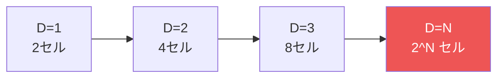
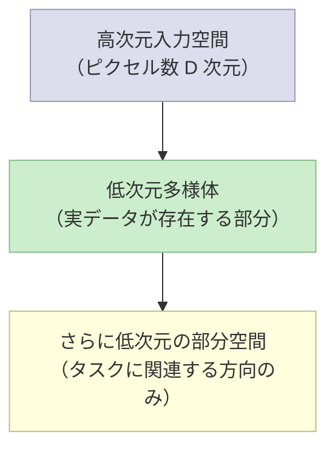

# 6.1 固定基底関数の限界

**出典:** C. M. Bishop, H. Bishop, *Deep Learning*, Springer 2024, §6.1
**担当:** （担当者名）
**日付:** 2025-04-18

---

## スライド

- [スライド (HTML)](slides.html)

---

## 概要

線形基底関数モデルは理論上あらゆる関数を近似できる。しかし**基底関数がデータから独立して固定されている**という仮定が、高次元の実問題では深刻な限界をもたらす。本節ではその限界を4つの観点で整理し、ニューラルネットワークの必要性を動機づける。

**線形基底関数モデルの形式：**

$$y(\mathbf{x}, \mathbf{w}) = f\!\left(\sum_{j=1}^{M} w_j \phi_j(\mathbf{x}) + w_0\right)$$

- $\phi_j(\mathbf{x})$：固定された非線形基底関数
- $\mathbf{w}$：訓練データから学習するパラメータ

---

## 6.1.1 次元の呪い（Curse of Dimensionality）

入力次元 $D$ が増えると、多項式モデルの係数数が $O(D^M)$ で爆発する（$M$ 次の場合）。

**グリッド分割による分類の失敗例：**

入力空間をグリッドセルに分割する単純な手法では、セル数が次元 $D$ に対して **指数的** に増加する。各セルを埋めるのに必要な訓練データ量も同様に指数的に増える。

固定基底関数を用いる限り、次元の呪いを回避するには基底関数の選び方を工夫するしかない。

---

## 6.1.2 高次元空間の性質

低次元で培った直感は高次元では通用しない。

**超球の体積集中：**

$D$ 次元超球（半径 $r=1$）において、表面付近の薄い殻 $[1-\varepsilon, 1]$ に含まれる体積の割合は：

$$1 - (1-\varepsilon)^D \xrightarrow{D\to\infty} 1$$

高次元では **体積のほぼすべてが表面付近に集中** する。同様にガウス分布でも確率質量が特定半径の薄い殻に集中する。

!!! note "示唆"
    高次元では低次元の直感が通用しない。本書の可視化例（1〜2変数）は理解を助けるが、高次元への一般化には注意が必要。

---

## 6.1.3 データ多様体（Data Manifolds）

実データは高次元空間全体に広がっているのではなく、**より低次元の多様体上に存在**する。

**手書き数字画像の例：**

- 各画像はピクセル数 $D$ 次元空間の1点
- 位置 $(x, y)$ と向き $\theta$ という **3自由度** しか変動しない
- → 画像は高次元空間内の **3次元多様体上** に存在（非線形）

**自然画像とランダム画像の比較：**

ランダムに各ピクセルを独立サンプリングした画像は、自然画像とはまったく異なる。自然画像は高次元空間の **ほんのわずかな部分** しか占めていない。

ニューラルネットワークはこのデータ多様体に適応した基底関数を学習する仕組みとして理解できる。

---

## 6.1.4 データ依存基底関数

固定基底関数の限界を克服するアプローチの歴史的変遷：

| 手法 | 基底関数の決め方 | 主な問題点 |
|------|-----------------|-----------|
| 手工芸特徴量 | 専門知識 + 試行錯誤 | アプリ依存・汎化困難 |
| 動径基底関数 (RBF) | 各訓練点を中心に配置 | 大規模データで非効率、過学習しやすい |
| サポートベクターマシン (SVM) | 訓練時に自動選択 | 確率出力なし・多クラス非対応・大規模データで限界 |
| **深層ニューラルネットワーク** | **データから階層的に学習** | **上記すべてを解決** |

!!! success "ニューラルネットワークの優位性"
    - 大規模データを効率的に活用できる
    - 確率的出力を自然に生成できる
    - 多クラス分類に自然に対応できる
    - 深い階層表現を学習できる（後の章で詳述）

---

## まとめ

| 節 | 問題 | キーメッセージ |
|---|---|---|
| 6.1.1 | 次元の呪い | パラメータ・データ量が次元に対して指数爆発 |
| 6.1.2 | 高次元の直感誤り | 体積・確率質量が表面付近に集中する |
| 6.1.3 | データ多様体 | 実データは低次元多様体上に存在する |
| 6.1.4 | データ依存基底関数 | 固定→手工芸→学習ベースへの必然的な進化 |

**結論：** 基底関数はデータから学習する必要がある → ニューラルネットワークへ

---

## 感想・議論

- 次元の呪いは回避できないのか？それとも実データの構造（多様体）が救ってくれるのか？
- SVMからDNNへの移行は何が決定的だったか？
- 「学習された基底関数」とは具体的にどんな形をしているのか？（→ 6章後半で深掘り）
