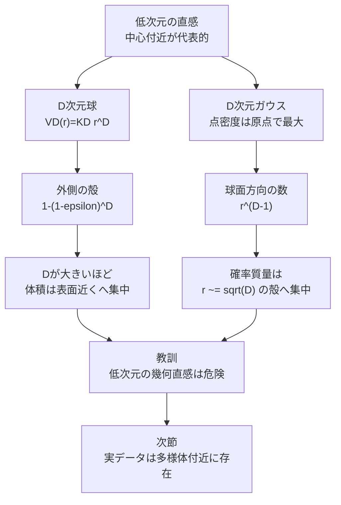

# 6.1.2 高次元空間

**出典:** C. M. Bishop, H. Bishop, *Deep Learning*, Springer 2024, §6.1.2  
**担当:** 駒月柊平  
**日付:** 2026-04-26

[← 概要に戻る](index.md)

---

## このサブセクションの位置づけ

§6.1.1 では、多項式基底やグリッド状の分類器を例に、入力次元が増えると必要な係数数・セル数が急増することを見た。本節では、その背景にある高次元空間そのものの性質を確認する。低次元で作った「中心付近に多くの体積がある」「原点付近にガウス分布の質量が集まる」といった直感は、高次元では大きく外れる。

!!! abstract "前後の接続"
    - **← 前（§6.1.1 次元の呪い）**: 固定基底関数を高次元空間全体に配置すると、基底数や訓練データ数が爆発的に必要になる。
    - **→ 次（§6.1.3 データ多様体）**: 高次元空間全体は扱いにくいが、実データは低い有効次元の多様体付近に集中することが多い。

---

## 高次元球では体積が表面近くに集まる

半径 $1$ の $D$ 次元超球を考える。低次元の直感では、体積は中心付近にも十分あるように感じる。しかし $D$ が大きくなると、体積のほとんどは表面直下の薄い殻に集中する。

### 数式の導出

**出発点：** 半径 $r$ の $D$ 次元超球の体積は、半径の $D$ 乗に比例する。

$$V_D(r) = K_D r^D \tag{6.4}$$

- $V_D(r)$：半径 $r$ の $D$ 次元超球の体積
- $K_D$：次元 $D$ だけに依存する定数
- $r^D$：半径を変えたときのスケーリングを決める項

半径 $1-\epsilon$ から $1$ までの薄い殻に含まれる体積の割合を求める。

$$
\frac{V_D(1) - V_D(1-\epsilon)}{V_D(1)}
= \frac{K_D - K_D(1-\epsilon)^D}{K_D}
= 1 - (1-\epsilon)^D
\tag{6.5}
$$

**結論：**

$$\text{外側の厚さ }\epsilon\text{ の殻にある体積割合} = 1 - (1-\epsilon)^D$$

### 直感的な理解

$D$ が大きいと、$(1-\epsilon)^D$ は小さくなりやすい。たとえば $\epsilon = 0.1$ でも、$D=20$ なら内側半径 $0.9$ の体積割合は $0.9^{20} \simeq 0.12$ しかなく、残りの約 $88\%$ が外側 10% の殻にある。

!!! note "高次元の中心は広くない"
    高次元球では、中心付近は半径方向には広く見えても、体積としてはほとんどを占めない。機械学習で「近い」「代表的」「平均的」を考えるとき、この性質は重要になる。

---

## ガウス分布の確率質量も薄い殻に集まる

高次元で直感が外れるのは一様な球だけではない。機械学習で頻繁に使う等方的ガウス分布でも、確率質量は原点そのものではなく、ある半径付近の薄い殻に集中する。

標準正規分布 $\mathcal{N}(\mathbf{0}, \mathbf{I})$ の密度は原点で最大だが、半径 $r$ の薄い殻には多くの方向がある。半径方向の確率密度は、点ごとの密度と、半径 $r$ の球面の表面積に対応する項の積として考えられる。

$$p(r) \propto r^{D-1}\exp\left(-\frac{r^2}{2}\right)$$

ここで $r^{D-1}$ は、半径が大きくなるほど球面上の方向数が増える効果を表す。一方、$\exp(-r^2/2)$ は原点から離れるほど点ごとの密度が下がる効果を表す。高次元ではこの二つの効果が釣り合い、確率質量は原点から離れた特定の半径付近に集中する。

### 最頻半径の導出

対数を取ると、最大化する対象は次の形になる。

$$\log p(r) = \text{const} + (D-1)\log r - \frac{r^2}{2}$$

$r$ で微分して $0$ とおく。

$$\frac{d}{dr}\log p(r) = \frac{D-1}{r} - r = 0$$

したがって、

$$r^2 = D - 1,\qquad r = \sqrt{D-1}$$

**結論：** 高次元標準ガウスの確率質量は、原点ではなく半径およそ $\sqrt{D}$ の薄い殻に集中する。

!!! warning "密度最大点と典型点は違う"
    ガウス分布の密度は原点で最大だが、高次元では原点付近の体積が小さいため、そこにある確率質量は大きくない。高次元確率では「密度が高い点」と「よくサンプルされる典型的な点」を分けて考える必要がある。

---

## 具体例・可視化

次の図は、高次元で二つの集中が起きる流れをまとめたもの。

### 薄い殻の体積割合

| 次元 $D$ | 外側 10% の殻の体積割合 $1-0.9^D$ | 解釈 |
|---|---:|---|
| 1 | 0.10 | 低次元では厚さにほぼ比例する |
| 2 | 0.19 | まだ中心側にもかなり体積がある |
| 5 | 0.41 | 外側の寄与が大きくなり始める |
| 20 | 0.88 | 体積の大半が表面近くにある |
| 100 | 0.99997 | ほぼすべてが外側 10% にある |

!!! success "高次元の利点もある"
    高次元は難しさだけを生むわけではない。§6.1.2 の後半では、1次元では重なって見えるクラスが、2次元では線形分離可能になる例が示される。表現空間を高次元化することで、分類問題が簡単になる場合もある。

---

## まとめ

| ポイント | 内容 |
|---|---|
| 超球の体積 | $V_D(r)=K_Dr^D$ なので、外側の薄い殻の体積割合は $1-(1-\epsilon)^D$ になる |
| 体積集中 | $D$ が大きいほど、超球の体積は表面近くに集中する |
| ガウス分布 | 点密度は原点で最大でも、確率質量は半径 $\sqrt{D}$ 付近の殻に集中する |
| 直感の破綻 | 低次元で自然な「中心」「近傍」「代表点」の感覚は、高次元ではそのまま使えない |
| 高次元の利点 | 次元を増やすことでクラスが線形分離しやすくなる場合もある |

**結論：** 高次元空間では、体積や確率質量が薄い殻に集中するため、低次元の幾何的直感はしばしば誤る。ただし高次元性は常に悪ではなく、適切な表現空間では分類を容易にする利点もある。

---

## 担当者の議論・疑問点

- 高次元ガウスで「密度最大の原点」と「典型的なサンプルの半径」が異なることは、生成モデルの評価や異常検知にどう影響するか？
- 距離に基づく最近傍法やクラスタリングは、高次元でどのように壊れやすいか？
- 高次元化が分類を容易にする例と、次元の呪いが問題になる例を分ける条件は何か？
- §6.1.3 のデータ多様体の仮定は、高次元空間の難しさをどの程度回避できるのか？
