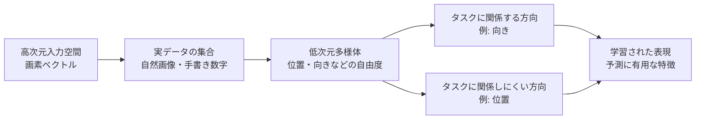

# 6.1.3 データ多様体

**出典:** C. M. Bishop, H. Bishop, *Deep Learning*, Springer 2024, §6.1.3  
**担当:** 駒月柊平  
**日付:** 2026-04-26

[← 概要に戻る](index.md)

---

## このサブセクションの位置づけ

§6.1.1 では、固定基底関数を入力空間全体に配置すると、次元の増加に対して必要な基底数が急増することを見た。§6.1.2 では、高次元空間では体積や確率質量の分布が低次元の直感と大きく異なることを確認した。本節では、それでも高次元データを扱える理由として、実データが高次元空間全体ではなく、低い有効次元をもつ構造の近くに集中するという見方を導入する。

!!! abstract "前後の接続"
    - **← 前（§6.1.2 高次元空間）**: 高次元空間全体は幾何的にも統計的にも扱いにくく、固定基底で密に覆う発想は破綻しやすい。
    - **→ 次（§6.1.4 データ依存基底関数）**: 実データが多様体付近にあるなら、基底関数も空間全体ではなくデータ多様体に沿って配置・学習すべきだと考えられる。

---

## 高次元データは空間全体を埋めていない

### まず直感で理解する

ざっくり言うと、画像や音声のようなデータは数値ベクトルとしては非常に高次元だが、あり得るベクトルの大半は「自然なデータ」ではない。たとえば $64 \times 64$ ピクセルのカラー画像は多数の画素値で表されるが、各画素を完全にランダムに選ぶと、自然画像ではなくノイズのような画像になる。

!!! note "ざっくり言うと"
    高次元空間には膨大な点があるが、実データが現れる点はそのごく一部に限られる。機械学習が利用したいのは、このごく一部にある規則的な構造である。

**身近な例え：** 地図全体を細かいマスで埋めるのではなく、実際に人が通る道路沿いだけを考えるイメージに近い。ただし厳密には、データ多様体は道路のように目で見える線とは限らず、高次元空間の中に曲がって埋め込まれた構造として考える。

### 正確な説明

入力データはしばしば高次元ベクトル $\mathbf{x} \in \mathbb{R}^D$ として表される。画像なら $D$ は画素数やチャンネル数で決まり、解像度を上げるだけでも $D$ は大きくなる。しかし、次元 $D$ が大きいことは、データが $\mathbb{R}^D$ 全体を自由に埋め尽くすことを意味しない。

教科書の例では、手書き数字の画像を考える。同じ数字でも、画像内での水平位置・垂直位置・回転角が変わると画素値は変化する。このとき画像は高次元の画素空間上の点だが、変化を生む自由度を大まかに見ると、水平移動、垂直移動、回転の 3 つである。したがって、この画像集合は高次元空間全体ではなく、近似的には 3 次元の非線形多様体上に存在すると見なせる。

ここでいう多様体は、局所的には低次元の座標で表せる構造である。画像の場合、物体の位置や向きが少し変わると画素値も連続的に変わるため、高次元空間の中でデータ点はばらばらに散るのではなく、曲がった低次元面の近くに並ぶ。

!!! warning "入力次元と有効次元は違う"
    画素数を増やすと入力次元 $D$ は増えるが、同じ物体の位置と向きだけが変わる状況なら、データを動かしている本質的な自由度は大きく変わらない。次元の呪いで問題になるのは入力空間全体の次元だが、学習で利用できる構造は有効次元に強く関係する。

---

## 多様体上に基底関数を置くという考え方

固定基底関数の失敗は、高次元空間全体を均一に覆おうとする点にある。もしデータが低次元多様体の近くにしか現れないなら、基底関数も空間全体に配置する必要はない。データが実際に存在する多様体に沿って局所的な基底関数を置ければ、必要な基底数は入力次元 $D$ ではなく、多様体の次元に依存すると期待できる。

### 数式の導出

**この式がやりたいこと：** 固定グリッドを高次元空間全体に置く場合と、データ多様体に沿って置く場合で、必要な局所領域の数がどのように変わるかを比較する。

**出発点：**

各軸を幅 $\epsilon$ の区間に分け、単位長の領域を覆うとする。1 次元あたり、およそ $1/\epsilon$ 個の区間が必要になる。

$$N_{\text{ambient}}(\epsilon) \simeq \left(\frac{1}{\epsilon}\right)^D$$

- $D$：入力空間の次元
- $\epsilon$：1 つの基底関数がカバーする局所領域の幅
- $N_{\text{ambient}}$：入力空間全体を覆うために必要な局所領域数

**導出：**

$D$ 次元空間では、各次元で $1/\epsilon$ 個の分割が必要になる。全体のセル数は各次元の分割数の積なので、

$$
\underbrace{\frac{1}{\epsilon}}_{\text{1次元目}}
\times
\underbrace{\frac{1}{\epsilon}}_{\text{2次元目}}
\times \cdots \times
\underbrace{\frac{1}{\epsilon}}_{\text{D次元目}}
= \left(\frac{1}{\epsilon}\right)^D
$$

一方、データが有効次元 $d$ の多様体上にあると考えられるなら、同じ粗さで多様体を覆うための数は近似的に

$$N_{\text{manifold}}(\epsilon) \simeq \left(\frac{1}{\epsilon}\right)^d$$

となる。

**結論：**

$$d \ll D \quad \Rightarrow \quad
N_{\text{manifold}}(\epsilon) \ll N_{\text{ambient}}(\epsilon)$$

### 数式の直感的な理解

この式が言っているのは、空間全体を塗りつぶすより、データが通る場所だけをたどる方がはるかに少ない部品で済むということ。入力次元 $D$ が大きくても、実データの変化を支配する自由度 $d$ が小さければ、学習問題は高次元空間全体を相手にするよりずっと扱いやすくなる。

!!! note "次元の呪いを完全に消すわけではない"
    多様体仮説は、なぜ高次元データでも学習できる場合があるのかを説明する。ただし、多様体の形が複雑だったり、タスクに必要な方向を見つけられなかったりすれば、依然として学習は難しい。

---

## タスクに関係する方向だけを学ぶ

データ多様体上のすべての方向が、予測に同じだけ重要とは限らない。手書き数字の画像で、位置と向きが変わると画素値は変わる。しかし、もし知りたいのが数字の向きだけなら、水平位置や垂直位置の変化はタスクにとって本質的ではない。

この点がニューラルネットワークにつながる。ニューラルネットワークは、単にデータ多様体に沿った表現を学ぶだけでなく、その多様体上で出力の予測に必要な方向を強調し、不要な方向を抑える表現を学習できる。固定基底関数ではこの適応が難しいため、データとタスクに依存して基底を学ぶ必要がある。

---

## 具体例・可視化

**簡単な例：** $28 \times 28$ のグレースケール画像は $784$ 次元ベクトルとして表せる。しかし、1 つの同じ数字を少しずつ右へ動かした画像だけを集めた場合、その変化はおおまかには「横位置」という 1 つの自由度で説明できる。画素空間の次元は $784$ でも、この小さなデータ集合の有効次元はかなり低い。

| 観点 | 入力空間全体を見る考え方 | データ多様体を見る考え方 |
|---|---|---|
| 対象 | すべての画素値の組み合わせ | 自然画像として現れやすい画素値の組み合わせ |
| 必要な基底 | 高次元空間全体を覆う数が必要 | データが存在する近傍を覆えばよい |
| 問題点 | セル数が入力次元に対して爆発する | 多様体の形とタスクに関係する方向を学ぶ必要がある |
| ニューラルネットワークとの関係 | 固定基底では非効率 | データに適応した特徴を学習できる |

!!! warning "ランダム画像はほとんど自然画像ではない"
    各ピクセルを独立にランダム生成すると、隣接ピクセル間の強い相関や物体の構造が失われる。自然画像が高次元空間のごく一部にしか存在しないことは、この例からも直感的に分かる。

---

## まとめ

| ポイント | ざっくり理解 | 正確な説明 |
|---|---|---|
| データ多様体 | 実データは高次元空間全体には広がらない | データは低い有効次元をもつ非線形多様体付近に集中することが多い |
| 入力次元と有効次元 | 画素数が多くても、本質的な変化は少ない場合がある | 解像度で $D$ が増えても、位置や向きなどの自由度は必ずしも増えない |
| 基底関数の配置 | データがある場所だけを覆えばよい | 必要な基底数は入力空間の次元ではなく、多様体の次元に依存すると期待できる |
| タスク依存性 | すべての変化が予測に必要とは限らない | 多様体上のどの方向が出力に関係するかを学習する必要がある |

**結論：** 高次元データを扱う難しさは、入力空間全体を相手にすると極端に大きくなる。しかし実データは低次元多様体付近に集中することが多く、ニューラルネットワークはその構造とタスクに関係する方向をデータから学ぶことで、固定基底関数の限界を乗り越える。

---

## 担当者の議論・疑問点

- 「自然画像は低次元多様体上にある」という仮定は、どの程度まで実験的に確かめられるか？
- データ多様体に沿った変化と、タスクに関係する変化を分けるには何が必要か？
- 解像度を上げると入力次元は増えるが、有効次元は本当に変わらないと言えるか？
- データ拡張は、多様体上のどの方向をモデルに学ばせていると解釈できるか？
