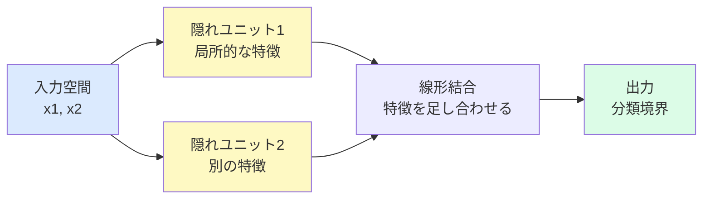
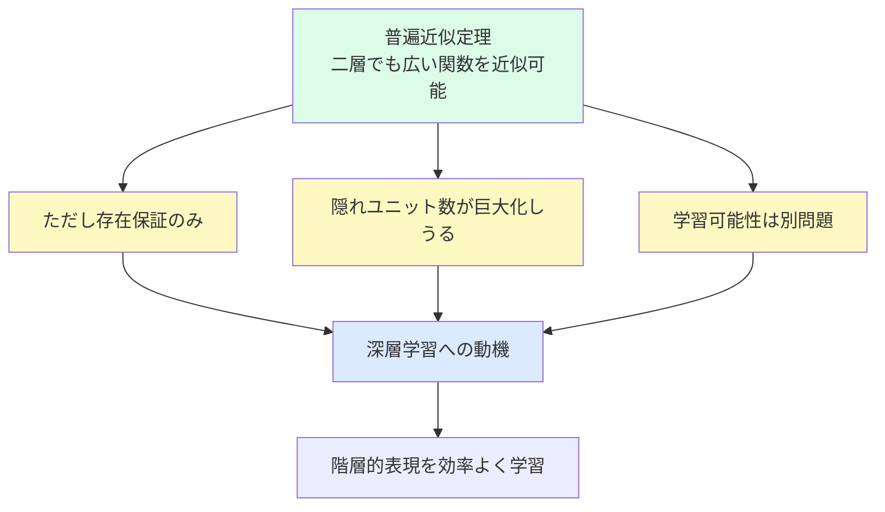

# 6.2.2 普遍近似定理

**出典:** C. M. Bishop, H. Bishop, *Deep Learning*, Springer 2024, §6.2.2  
**担当:** 駒月柊平  
**日付:** 2026-04-26

[← 概要に戻る](index.md)
 / [次: 6.2.3 隠れユニット活性化関数 →](6-2-3.md)

---

## このサブセクションの位置づけ

§6.2.1 では、二層ネットワークを

$$
\mathbf{y}(\mathbf{x}, \mathbf{w}) = f\!\left(\mathbf{W}^{(2)}h(\mathbf{W}^{(1)}\mathbf{x})\right)
$$

という行列表記で書けることを見た。本節では、この形のネットワークがどれほど広い関数を表せるのかを扱う。結論は強力で、十分な数の隠れユニットを用意すれば、二層ネットワークだけでも非常に広い範囲の関数を任意の精度で近似できる。

!!! abstract "前後の接続"
    - **← 前（§6.2.1 パラメータ行列）**: 二層ネットワークを、学習可能な基底関数の線形結合としてコンパクトに表した
    - **→ 次（§6.2.3 隠れユニット活性化関数）**: 普遍近似の保証は、適切な非線形活性化関数を使うことに依存する。ではどの活性化関数を選ぶべきかを次に整理する

---

## 普遍近似定理が言っていること

### まず直感で理解する

!!! note "ざっくり言うと"
    普遍近似定理は、「二層ネットワークは、隠れユニットを十分に増やせば、かなり複雑な関数でも好きなだけ近くまねできる」という主張である。ただし、これは「その重みが存在する」という話であって、「学習で必ず見つかる」という話ではない。

**身近な例え：** なめらかな曲線を短い線分や小さな部品の組み合わせで近似するイメージに近い。1個の部品では大まかな形しか作れないが、部品を増やせば細かい凹凸まで追える。ただし、部品が十分にあっても、それをどう配置すればよいかを自動で簡単に見つけられるとは限らない。

<!-- image-slot: universal-approximation-building-blocks -->

### 正確な説明

二層フィードフォワードネットワークは、入力 $\mathbf{x}$ を受け取り、隠れユニットの出力を線形結合して最終出力を作る。スカラー出力の場合、基本形は次のように書ける。

$$
y(\mathbf{x}, \mathbf{w})
= \sum_{j=1}^{M} w_j^{(2)} h\!\left(\sum_{i=0}^{D} w_{ji}^{(1)}x_i\right)
$$

ここで $x_0=1$ とすれば、バイアスも重みの中に吸収されている。各隠れユニット

$$
h\!\left(\sum_{i=0}^{D} w_{ji}^{(1)}x_i\right)
$$

は、入力空間上に置かれた「形を変えられる基底関数」と見なせる。第1層の重みは各基底関数の位置・向き・傾きのような性質を決め、第2層の重みはそれらをどの強さで足し合わせるかを決める。

1980年代後半の結果（Funahashi, Cybenko, Hornik ら）により、幅広い活性化関数に対して、このような二層ネットワークは $\mathbb{R}^D$ の連続的な領域上で定義された任意の連続関数を、任意の精度で近似できることが示された。有限次元の離散空間から別の有限次元空間への関数についても、同様の結果が成り立つ。

!!! success "この定理の強さ"
    二層ネットワークは、固定された少数の関数形だけを表すモデルではない。隠れユニット数 $M$ を増やすことで、非常に広い関数クラスを表現できる。

---

## 数式で見る「近似できる」の意味

普遍近似定理の核心は、「目標関数とネットワーク関数の差を、好きな小ささまで抑えられる」という形で理解できる。

**この式がやりたいこと：** 目標関数 $g(\mathbf{x})$ とネットワーク $y(\mathbf{x}, \mathbf{w})$ の最大誤差が、指定した許容誤差 $\varepsilon$ より小さくなる、という状況を表す。

**出発点：**

目標関数を

$$
g(\mathbf{x})
$$

ネットワークが表す関数を

$$
y(\mathbf{x}, \mathbf{w})
$$

とする。近似したい領域を $\mathcal{X}$ と書く。

**ステップ1：各点での誤差を見る**

入力 $\mathbf{x}$ における誤差は

$$
\left|g(\mathbf{x}) - y(\mathbf{x}, \mathbf{w})\right|
$$

である。この値が小さいほど、その入力に対する近似はよい。

**ステップ2：領域全体で最悪の誤差を見る**

1点だけでなく、領域 $\mathcal{X}$ 全体でよい近似になってほしいので、最大誤差を考える。

$$
\sup_{\mathbf{x}\in\mathcal{X}}
\left|g(\mathbf{x}) - y(\mathbf{x}, \mathbf{w})\right|
$$

ここで $\sup$ は「上限」を表し、直感的には「一番悪い場所での誤差」と読めばよい。

**ステップ3：任意の精度で近似できる**

任意の小さな正の数 $\varepsilon > 0$ に対して、十分な隠れユニット数 $M$ と重み $\mathbf{w}$ を選べば、

$$
\sup_{\mathbf{x}\in\mathcal{X}}
\left|g(\mathbf{x}) - y(\mathbf{x}, \mathbf{w})\right|
< \varepsilon
$$

とできる。これが「任意精度で近似できる」という言葉の中身である。

!!! warning "存在と学習を混同しない"
    上の式は、「そのような $M$ と $\mathbf{w}$ が存在する」と言っているだけである。SGD や Adam が、その重みを有限時間で見つけられることまでは保証しない。

### 数式の直感的な理解

この式が言っているのは、目標関数のグラフとネットワークのグラフを見比べたとき、近似領域のどこを見てもズレが $\varepsilon$ 未満になるようにできる、ということである。$\varepsilon$ を小さくするほど高精度な近似を要求していることになり、多くの場合はより多くの隠れユニットが必要になる。

!!! note "キーポイント"
    普遍近似定理の「万能」は、有限個の隠れユニットで何でも完全に表すという意味ではない。隠れユニットを十分に増やせば、指定した誤差以下に近づけられるという意味である。

---

## 図 6.10 と図 6.11 の読み方

§6.2.2 では、二層ネットワークの近似能力を二つの図で示している。

### 関数近似の例

図 6.10 では、3個の tanh 隠れユニットを持つ二層ネットワークが、次のような1次元関数を近似する様子が示されている。

| 目標関数 | 性質 | 見るべき点 |
|---|---|---|
| $f(x)=x^2$ | なめらかな曲線 | 複数の隠れユニットが曲率を分担する |
| $f(x)=\sin(x)$ | 周期的な曲線 | 局所的な上下動を組み合わせて追う |
| $f(x)=|x|$ | $x=0$ に折れ曲がり | 非線形な角も近似できる |
| $f(x)=H(x)$ | ステップ関数 | 不連続に近い急な変化も、連続関数で近くまねる |

!!! note "隠れユニットは協調して働く"
    1つの隠れユニットが目標関数全体を担当するのではない。複数の隠れユニットの出力を足し合わせることで、最終的な関数の形が作られる。

### 分類問題の例

図 6.11 では、2入力・2隠れユニット・1出力のネットワークが、二値分類の決定境界を作る様子が示されている。各隠れユニットは入力空間に1本の境界のような構造を作り、出力ユニットがそれらを組み合わせて最終的な分類境界を作る。

!!! warning "図の読み間違い"
    隠れユニットの境界そのものが最終的な分類境界ではない。最終的な境界は、隠れユニット出力を出力層で組み合わせた結果として現れる。

---

## 普遍近似定理の限界

普遍近似定理はニューラルネットワークの表現力を支える重要な結果だが、実用上の問題をすべて解決するわけではない。

### 1. 存在は保証するが、発見は保証しない

定理は「よい重みが存在する」と言うだけで、「学習アルゴリズムがその重みに到達する」とは言わない。損失関数の形、初期値、最適化手法、データ数、正則化などが学習結果を左右する。

### 2. 隠れユニット数が指数的に増える場合がある

ある関数を二層ネットワークで表すには、隠れユニット数が入力次元に対して指数的に必要になる場合がある。つまり、理論的には近似できても、モデルサイズが現実的でない可能性がある。

### 3. No Free Lunch 定理との関係

後の節で扱う No Free Lunch 定理は、あらゆる問題に対して常に最良に働く万能な学習アルゴリズムは存在しない、という考え方を与える。普遍近似定理が表現力の広さを述べる一方で、No Free Lunch は学習問題全体に対する万能性には限界があることを示す。

### 4. 深さの利点を否定しない

二層ネットワークが普遍近似器であることは、深いネットワークが不要という意味ではない。実用上は、多層ネットワークが階層的な内部表現を学習できるため、同じ関数をはるかに効率よく表せることがある。

---

## 具体例：折れ線的に曲線を近似する

1次元入力 $x$ に対して、目標関数 $g(x)=x^2$ を考える。少数の隠れユニットでは、ネットワークは曲線の大まかな傾向しか追えない。

| 隠れユニット数 | 直感的な状態 | 近似の特徴 |
|---|---|---|
| 少ない | 部品が足りない | 大まかな曲がりだけを表す |
| 中くらい | いくつかの領域を分担 | 曲率をかなり追える |
| 多い | 細かく調整できる | 誤差を小さくできる |

ここで重要なのは、隠れユニットの数を増やすほど表現力は増すが、学習するパラメータも増えるという点である。表現力・計算量・過学習リスクのバランスを取る必要がある。

!!! warning "「ユニットを増やせば常に良い」ではない"
    訓練データへの当てはまりは改善しても、未知データへの汎化が悪くなることがある。普遍近似定理は汎化性能を直接保証しない。

---

## まとめ

| ポイント | ざっくり理解 | 正確な説明 |
|---|---|---|
| 普遍近似 | 二層ネットワークはかなり万能 | 幅広い活性化関数のもとで、任意の連続関数を任意精度で近似できる |
| 隠れユニット | 小さな部品を組み合わせる | 第1層が基底関数を作り、第2層がそれらを線形結合する |
| 存在保証 | 近似できる重みはある | 学習アルゴリズムがその重みを見つける保証はない |
| ユニット数 | 部品が多いほど細かく作れる | 場合によっては指数的に多くの隠れユニットが必要 |
| 深さの意味 | 二層で足りるなら深層はいらない、ではない | 深いネットワークは階層的表現により効率よく関数を表せることがある |

**結論：** 普遍近似定理は、ニューラルネットワークが豊かな表現力を持つことを理論的に支える。ただし、その保証は「存在」に関するものであり、実際の学習可能性・必要なユニット数・汎化性能までは保証しない。この限界が、活性化関数の選択や深いネットワーク設計を考える動機になる。

---

## 担当者の議論・疑問点

- **「存在する重み」と「学習で見つかる重み」のギャップ**：普遍近似定理で保証される重みは、実際の SGD でどれほど見つけやすいのか？
- **深さによる効率化の具体例**：二層では指数的に多くの隠れユニットが必要だが、深層なら少ないパラメータで表せる関数の例を整理したい。
- **不連続関数の扱い**：図 6.10 のステップ関数のような不連続に近い関数を、連続な活性化関数でどの意味で近似しているのか？
- **汎化との関係**：表現力が高いほど訓練データには合うが、未知データに強いとは限らない。この点を正則化やデータ量とどう結びつけて考えるべきか？
- **§6.2.3 との接続**：普遍近似の定理では幅広い活性化関数が許される一方、実用では ReLU が強い。この差は表現力ではなく最適化のしやすさに由来するのか？
