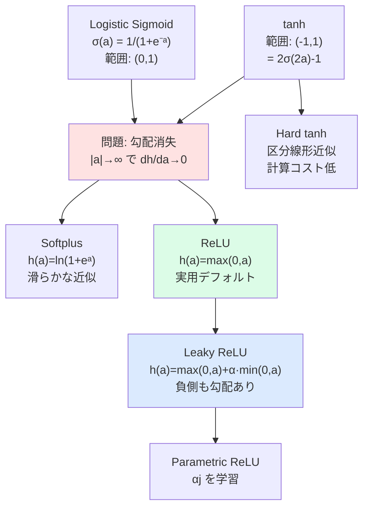

# 6.2.3 隠れユニット活性化関数

**出典:** C. M. Bishop, H. Bishop, *Deep Learning*, Springer 2024, §6.2.3
**担当:** 駒月柊平
**日付:** 2026-04-26

[← 概要に戻る](index.md)
 / [次: 6.2.4 重み空間の対称性 →](6-2-4.md)

---

## このサブセクションの位置づけ

§6.2.2 では「二層ネットワークは万能近似器（Universal Approximator）である」という強力な理論的保証を学んだ。しかし、その保証はあくまで**適切な活性化関数が選ばれていること**を前提としている。本節では、隠れユニットの活性化関数として何が使えて、何が良い選択なのかを系統的に整理する。

!!! abstract "前後の接続"
    - **← 前（§6.2.2 普遍近似定理）**: 万能近似の保証は「微分可能な活性化関数」という条件に基づく。ではどんな関数が有効か？→ 本節で整理
    - **→ 次（§6.2.4 重み空間の対称性）**: 活性化関数の奇関数性（tanh など）は重み空間の符号反転対称性を生み出す。活性化関数の選択と対称性は密接に関係する

---

## なぜ線形活性化関数では不十分か

まず自然な問いから始める：「活性化関数に恒等写像 $h(a) = a$ を使えばどうなるか？」

### 線形変換の合成は線形

**出発点：** 二層ネットワークの関数

$$\mathbf{y}(\mathbf{x}, \mathbf{w}) = f\!\left(\mathbf{W}^{(2)} h\!\left(\mathbf{W}^{(1)} \mathbf{x}\right)\right)$$

$h$ が恒等写像（線形）で $f$ も線形なら：

$$\mathbf{y} = \mathbf{W}^{(2)}\mathbf{W}^{(1)}\mathbf{x} = \mathbf{A}\mathbf{x}$$

**結論：** $\mathbf{A} = \mathbf{W}^{(2)}\mathbf{W}^{(1)}$ は単なる行列積であり、隠れ層は意味をなさない。何層積み重ねても「1層の線形変換」と等価になる。

!!! warning "唯一の例外：ボトルネック構造"
    隠れユニット数 $M$ が入力次元 $D$ や出力次元 $K$ より小さい場合、線形隠れ層は情報を次元削減する。パラメータ数 $M(N+K)$ 対 直接写像 $NK$ というトレードオフが生まれ、これは**主成分分析（PCA）**と等価な操作に相当する。ただし、非線形表現を獲得するという本来の目的は果たせない。

---

## 各活性化関数の詳細

### Logistic Sigmoid

$$\sigma(a) = \frac{1}{1+\exp(-a)} \tag{6.13}$$

出力範囲は $(0, 1)$。生物学的ニューロンの発火率のモデルに着想を得た初期の標準的選択肢。

**微分：**

$$\frac{d\sigma}{da} = \sigma(a)\bigl(1 - \sigma(a)\bigr)$$

$a \to \pm\infty$ で $\sigma(a) \to 0$ または $1$ となり、微分は **指数的にゼロ** に近づく。

### tanh

$$\tanh(a) = \frac{e^a - e^{-a}}{e^a + e^{-a}} \tag{6.14}$$

出力範囲は $(-1, 1)$。Sigmoid との関係：

$$\tanh(a) = 2\sigma(2a) - 1$$

すなわち、入出力に線形変換を施した sigmoid と等価。**理論上** はどちらを使っても等価なネットワークが存在するが、**実際の学習では等価でない**。勾配法ではパラメータの初期化が重要であり、活性化関数を変えれば初期化スキームも変える必要がある。

tanh も sigmoid と同様に、大きな $|a|$ で勾配が消失する。

### Hard tanh（Collobert, 2004）

$$h(a) = \max(-1, \min(1, a)) \tag{6.15}$$

tanh の区分線形近似。$a \in [-1, 1]$ で傾き $1$、それ以外で定数。計算コストが低い代わりに、$a = \pm 1$ で微分不連続点を持つ（実用上は無視可）。

### Softplus

$$h(a) = \ln(1 + \exp(a)) \tag{6.16}$$

**導出の直感：**

$$\frac{dh}{da} = \frac{\exp(a)}{1 + \exp(a)} = \sigma(a)$$

微分が sigmoid になる。$a \gg 1$ の極限で：

$$h(a) = \ln(1 + e^a) \approx \ln(e^a) = a$$

つまり大きな正値では $h(a) \approx a$ となり、**勾配が 1 に近い非ゼロ値**を保つ。勾配消失を緩和する性質がある。後述の ReLU の滑らか版（Soft ReLU）とも呼ばれる。

### ReLU（Rectified Linear Unit）

$$h(a) = \max(0, a) \tag{6.17}$$

最もシンプルかつ現在最も広く使われる活性化関数（Krizhevsky, Sutskever, and Hinton, 2012）。

**微分：**

$$\frac{dh}{da} = \begin{cases} 1 & (a > 0) \\ 0 & (a < 0) \end{cases}$$

$a = 0$ では技術的に微分不定義だが、実用上は無視して問題ない。

!!! success "ReLU の優位性"
    1. **正側で勾配 = 1**：勾配消失が起きない（正値の範囲で）
    2. **初期化への頑健性**：sigmoid/tanh と比べて重み初期値の影響を受けにくい
    3. **低精度実装に適合**：8-bit 固定小数点でも 64-bit 浮動小数点と同等の性能
    4. **計算コストが低い**：max 演算のみ

!!! warning "Dying ReLU 問題"
    $a < 0$ ではグラジェントが常に $0$ になるため、あるユニットへの入力が常に負になると、そのユニットは訓練中に一切の「誤差信号」を受け取らない。大きな学習率や特定の初期化によって発生しやすい。

### Leaky ReLU

$$h(a) = \max(0, a) + \alpha \min(0, a), \quad 0 < \alpha < 1 \tag{6.18}$$

Dying ReLU 問題への対処。負値でも傾き $\alpha$ の非ゼロ勾配を持つ。

- **特殊ケース** $\alpha = -1$：$h(a) = |a|$（絶対値関数）
- **Parametric ReLU（PReLU）**：各隠れユニットが独自の $\alpha_j$ を持ち、重み・バイアスと同様に勾配降下法で学習する

---

## 具体例・可視化

### 勾配消失から ReLU への系譜

### 活性化関数の比較表

| 関数 | 定義 | 出力範囲 | 勾配消失 | 主な問題点 |
|------|------|----------|----------|-----------|
| Identity | $h(a) = a$ | $(-\infty, \infty)$ | なし | 非線形表現不能 |
| Logistic sigmoid | $\frac{1}{1+e^{-a}}$ | $(0, 1)$ | **あり** | 勾配消失・出力オフセット |
| tanh | $\frac{e^a-e^{-a}}{e^a+e^{-a}}$ | $(-1, 1)$ | **あり** | 勾配消失 |
| Hard tanh | $\max(-1,\min(1,a))$ | $[-1, 1]$ | 境界で**あり** | 非微分点 |
| Softplus | $\ln(1+e^a)$ | $(0, \infty)$ | 緩和 | 計算コストやや高 |
| ReLU | $\max(0, a)$ | $[0, \infty)$ | 正側なし | Dying ReLU（負側） |
| Leaky ReLU | $\max(0,a)+\alpha\min(0,a)$ | $(-\infty, \infty)$ | なし | $\alpha$ の設定 |

### 勾配の挙動（数式確認）

**sigmoid の勾配消失：**

$$\frac{d\sigma}{da}\bigg|_{a=5} = \sigma(5)(1-\sigma(5)) \approx 0.993 \times 0.007 \approx 0.007$$

$$\frac{d\sigma}{da}\bigg|_{a=10} \approx 4.5 \times 10^{-5}$$

大きな正値では勾配が指数的に 0 へ。深いネットワークでは層を経るごとに掛け算されるため、**入力層に近いほど勾配がほぼ消える**。

**ReLU の勾配（正値）：**

$$\frac{dh}{da}\bigg|_{a=5} = 1, \quad \frac{dh}{da}\bigg|_{a=100} = 1$$

正値の入力に対して勾配は常に 1。深い層でも勾配が消えない。

!!! note "実践的指針"
    特定の理由がない限り、**ReLU をデフォルト**として使用する。Dying ReLU が懸念される場合は Leaky ReLU または PReLU を検討する。sigmoid/tanh は出力層の確率モデリングなどに用途を限定するのが現代的なプラクティス。

---

## まとめ

| ポイント | 内容 |
|----------|------|
| 線形活性化の限界 | 合成が線形となり隠れ層が無意味になる（例外: ボトルネック→PCA相当） |
| sigmoid/tanh の問題 | 大きな $\|a\|$ で勾配が指数的に消失（vanishing gradients） |
| Softplus の位置づけ | ReLU の滑らか版；大きな正値で $h(a)\approx a$ により勾配を保持 |
| ReLU の優位性 | 正側で勾配 = 1、計算安価、初期化頑健、低精度実装に適合 |
| Leaky/Parametric ReLU | Dying ReLU への対処；負側にも非ゼロ勾配を与える |

**結論：** 隠れユニットの活性化関数は非線形かつ微分可能であればよいが、実用的には勾配消失を避けることが最重要。ReLU の登場（2012年）は深層学習の実用化を大きく前進させた。活性化関数の選択は表現力だけでなく、学習ダイナミクス全体に影響する。

---

## 担当者の議論・疑問点

- **Dying ReLU の発生条件を定量的に把握したい**：学習率・重み初期化（Xavier/He）・バッチサイズのどの組み合わせが Dying ReLU を引き起こしやすいか？
- **sigmoid と tanh が実質等価（$\tanh(a)=2\sigma(2a)-1$）でも学習が等価でない理由**：具体的にどの初期化スキームを変えれば同等になるか？（Exercise 6.4 との関連）
- **Parametric ReLU の $\alpha_j$ 学習の実際**：ユニットごとに異なる $\alpha_j$ に収束するか、それとも均質化するか？実験的知見は？
- **Softplus vs ReLU の選択基準**：滑らかさが必要な場面（二階微分が必要な物理インフォームドニューラルネット等）での使い分け
- **§6.2.4 との接続**：tanh が奇関数であることが符号反転対称性の前提。ReLU で同じ議論はできるか？（ReLU は奇関数でない）
