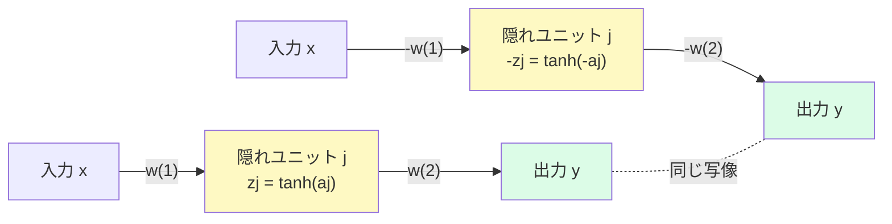
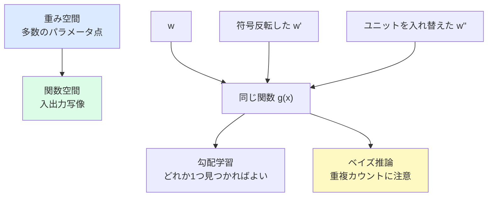

# 6.2.4 重み空間の対称性

**出典:** C. M. Bishop, H. Bishop, *Deep Learning*, Springer 2024, §6.2.4  
**担当:** 駒月柊平  
**日付:** 2026-04-26

[← 概要に戻る](index.md)

---

## このサブセクションの位置づけ

§6.2.3 では隠れユニットの活性化関数を見た。特に tanh は奇関数であり、

$$
\tanh(-a) = -\tanh(a)
$$

を満たす。この性質は、ネットワークの**重みの表し方**に冗長性を生む。§6.2.4 の主題は、フィードフォワードネットワークでは「異なる重みベクトル」が「同じ入出力関数」を表すことがある、という点である。

!!! abstract "前後の接続"
    - **← 前（§6.2.3 隠れユニット活性化関数）**: tanh の奇関数性や ReLU 系活性化関数の性質を整理した
    - **→ 次（§6.3 深層ネットワーク）**: 二層ネットワークの構造を多層へ拡張する。対称性も隠れ層ごとに現れる

---

## 重み空間の対称性とは何か

ニューラルネットワークの学習では、パラメータ全体を一つのベクトル

$$
\mathbf{w}
$$

として見ることが多い。この $\mathbf{w}$ が動く空間を**重み空間（weight space）**と呼ぶ。

重み空間の対称性とは、次のような状況を指す。

$$
\mathbf{w} \neq \mathbf{w}' \quad \text{だが} \quad
\mathbf{y}(\mathbf{x}, \mathbf{w}) = \mathbf{y}(\mathbf{x}, \mathbf{w}')
\quad \text{for all } \mathbf{x}
$$

つまり、パラメータ値としては別物なのに、関数としては完全に同じ写像を表す。

!!! note "重要な区別"
    対称性は「似た出力を出す」ことではなく、**すべての入力に対して同じ出力を出す**ことを意味する。したがって、これは近似的な偶然ではなく、ネットワーク構造そのものが持つ厳密な冗長性である。

---

## 例として扱うネットワーク

§6.2.4 では、次の二層ネットワークを考える。

- 入力層
- $M$ 個の隠れユニット
- tanh 活性化関数
- 入力層から隠れ層、隠れ層から出力層まで完全結合

バイアスを含めて書くと、隠れユニット $j$ の前活性化は

$$
a_j = \sum_i w_{ji}^{(1)} x_i + w_{j0}^{(1)}
$$

隠れユニット出力は

$$
z_j = \tanh(a_j)
$$

出力層への寄与は

$$
w_{kj}^{(2)} z_j
$$

である。

この構造に対して、主に二種類の対称性が現れる。

---

## 1. 符号反転対称性

### 変換

ある隠れユニット $j$ に注目する。このユニットに**入ってくる重みとバイアス**をすべて符号反転する。

$$
w_{ji}^{(1)} \mapsto -w_{ji}^{(1)}, \quad
w_{j0}^{(1)} \mapsto -w_{j0}^{(1)}
$$

すると前活性化は

$$
a_j \mapsto -a_j
$$

となる。tanh は奇関数なので、

$$
z_j = \tanh(a_j) \mapsto \tanh(-a_j) = -\tanh(a_j) = -z_j
$$

つまり、この隠れユニットの出力だけが符号反転する。

次に、この隠れユニットから**出ていく重み**をすべて符号反転する。

$$
w_{kj}^{(2)} \mapsto -w_{kj}^{(2)}
$$

すると出力層への寄与は

$$
w_{kj}^{(2)} z_j
\mapsto
(-w_{kj}^{(2)})(-z_j)
=
w_{kj}^{(2)} z_j
$$

となり、元と完全に一致する。

### 直感

隠れユニットの内部表現を反転しても、その後段の重みも同時に反転すれば、最終出力から見ると何も変わらない。

### 何通りあるか

各隠れユニットについて、符号を反転するか、しないかの二択がある。隠れユニットが $M$ 個あれば、

$$
2^M
$$

通りの等価な重みベクトルが存在する。

---

## 2. 入れ替え対称性

### 変換

次に、二つの隠れユニット $j$ と $l$ を考える。

この二つについて、次をすべて入れ替える。

- それぞれの隠れユニットに入ってくる重み
- それぞれのバイアス
- それぞれの隠れユニットから出ていく重み

これは、隠れユニットの**名前**や**順序**を入れ替えているだけである。出力層から見ると、同じ計算部品が別の番号に移動しただけなので、ネットワーク全体の入出力写像は変わらない。

### 数式で見る

出力層の前活性化のうち、隠れ層からの寄与は

$$
\sum_{j=1}^{M} w_{kj}^{(2)} z_j
$$

である。隠れユニットの順序を並べ替えても、これは和であるため値は変わらない。例えば $j=1$ と $j=2$ を入れ替えても、

$$
w_{k1}^{(2)} z_1 + w_{k2}^{(2)} z_2
$$

が

$$
w_{k2}^{(2)} z_2 + w_{k1}^{(2)} z_1
$$

になるだけで、同じ値である。

### 何通りあるか

$M$ 個の隠れユニットの並べ替えは

$$
M \times (M-1) \times \cdots \times 2 \times 1 = M!
$$

通りある。したがって、任意の重みベクトルは少なくとも $M!$ 個の等価な重みベクトルの集合に属する。

---

## 総対称性因子

符号反転対称性と入れ替え対称性を合わせると、二層ネットワークの重み空間には

$$
\text{対称性因子} = M! \cdot 2^M
$$

の等価な表現が存在する。

| 対称性 | 操作 | 等価解の数 |
|--------|------|------------|
| 符号反転 | 各隠れユニットの入力側と出力側の重みを同時に反転 | $2^M$ |
| 入れ替え | 隠れユニットの番号を並べ替える | $M!$ |
| 合計 | 両方を組み合わせる | $M!2^M$ |

例えば $M=3$ なら、

$$
3! \cdot 2^3 = 6 \cdot 8 = 48
$$

通りの異なる重みベクトルが、同じ関数を表す。

!!! warning "「同じ関数」と「同じ学習経路」は違う"
    これらの重みベクトルは最終的な入出力写像としては等価だが、初期値や最適化の途中経路まで同じになるとは限らない。対称性は目的関数の形に複数の等価な谷やモードを作る。

---

## 多層ネットワークの場合

二層ネットワークでは、隠れ層が一つなので対称性因子は

$$
M!2^M
$$

だった。

より深いネットワークでは、隠れ層ごとに同様の対称性が現れる。第 $l$ 隠れ層のユニット数を $M_l$ とすると、層ごとの因子を掛け合わせて、

$$
\prod_l M_l! \, 2^{M_l}
$$

のような形で総対称性が増えていく。

!!! note "深層化で冗長性も増える"
    深いネットワークは表現力を増す一方で、同じ関数を表すパラメータ表現も大量に持つ。これはニューラルネットワークの「関数空間」と「パラメータ空間」が一対一対応していないことを示している。

---

## tanh だけの話ではない

上の符号反転の説明では tanh の奇関数性を使った。しかし、Bishop and Bishop は、重み空間の対称性は tanh だけに特有の現象ではなく、幅広い活性化関数に対して現れると述べている。

特に入れ替え対称性は、活性化関数の種類にほとんど依存しない。隠れユニットが同じ構造・同じ活性化関数を持つなら、ユニット番号を入れ替えてもネットワークが表す関数は変わらない。

一方、符号反転対称性の具体的な形は活性化関数に依存する。tanh では

$$
h(-a) = -h(a)
$$

が成り立つため、符号反転で厳密に補償できる。ReLU は

$$
\operatorname{ReLU}(-a) \neq -\operatorname{ReLU}(a)
$$

なので、tanh と同じ符号反転の議論はそのままでは使えない。ただし、同種の隠れユニットを並べ替える対称性は ReLU ネットワークにも存在する。

---

## 実用上の意味

### 通常の勾配学習では大きな問題になりにくい

SGD や Adam などでネットワークを訓練する場合、目的は「良い予測をするパラメータを一つ見つける」ことである。等価な解が他に多数存在しても、そのうち一つに到達できれば十分なので、重み空間の対称性は通常あまり問題にならない。

### ベイズ的手法では重要になる

一方、ベイズ的に「ネットワークサイズの異なるモデル」を比較したり、事後分布全体を扱ったりする場合、この冗長性は無視しにくい。

同じ関数に対応する重みベクトルが $M!2^M$ 個あるなら、重み空間上で確率質量や積分を数えるときに、その分だけ同じ関数を重複して数えてしまう可能性がある。したがって、モデル証拠やネットワークサイズの事後分布を評価する際には、対称性因子を考慮する必要がある。

---

## 具体例：隠れユニット2個の場合

$M=2$ の tanh 二層ネットワークを考える。このとき総対称性因子は

$$
2! \cdot 2^2 = 8
$$

である。

| 操作 | 説明 |
|------|------|
| 何もしない | 元の重みベクトル |
| ユニット1の符号反転 | ユニット1の入力側・出力側を同時に反転 |
| ユニット2の符号反転 | ユニット2の入力側・出力側を同時に反転 |
| 両方の符号反転 | ユニット1・2の両方を反転 |
| ユニット1と2の入れ替え | 隠れユニットの番号を交換 |
| 入れ替え + ユニット1側の符号反転 | 並べ替え後に片方を反転 |
| 入れ替え + ユニット2側の符号反転 | 並べ替え後にもう片方を反転 |
| 入れ替え + 両方の符号反転 | 並べ替え後に両方を反転 |

これらは重みベクトルとしては異なるが、ネットワークが表す関数は同じである。

---

## まとめ

| ポイント | 内容 |
|----------|------|
| 重み空間の対称性 | 異なる重みベクトルが同じ入出力関数を表す |
| 符号反転対称性 | tanh の奇関数性により、入力側と出力側の符号反転が打ち消し合う |
| 入れ替え対称性 | 隠れユニットの順序を入れ替えても、和の値は変わらない |
| 二層ネットワークの因子 | $M!2^M$ |
| 多層ネットワーク | 隠れ層ごとの対称性因子を掛け合わせる |
| 実用上の影響 | 通常の勾配学習では小さいが、ベイズ的モデル比較では重要 |

**結論：** ニューラルネットワークのパラメータ化は冗長であり、重み空間の一点と関数空間の一点は一対一に対応しない。この冗長性は通常の訓練では大きな障害になりにくいが、事後分布やモデル証拠のように「重み空間全体を数える」議論では明示的に扱う必要がある。

---

## 担当者の議論・疑問点

- **ReLU ネットワークの対称性はどこまで同じか？** 入れ替え対称性は明らかに残るが、tanh 型の符号反転対称性はそのままでは成り立たない。ReLU 特有のスケーリング対称性との関係も整理したい。
- **等価解が多数あると損失地形はどう見えるか？** $M!2^M$ 個の等価なモードがあるなら、最適化の軌道や可視化にどのように現れるか。
- **ベイズ的モデル選択での補正方法** 同じ関数を重複して数えないために、対称性因子をどのように事前分布やモデル証拠へ反映するか。
- **ユニットが完全には同質でない場合** dropout、batch normalization、残差接続、ユニットごとの異なる活性化関数があると、どの対称性が壊れるか。
