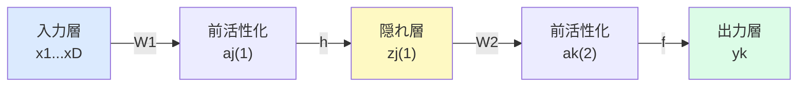
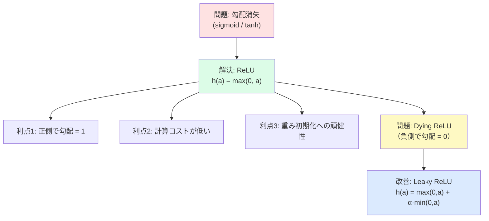

# 6.2 多層ネットワーク（Multilayer Networks）

**出典:** C. M. Bishop, H. Bishop, *Deep Learning*, Springer 2024, §6.2
**担当:** 駒月柊平
**日付:** 2026-04-26

---

## 概要

線形モデルでは基底関数 $\phi_j(\mathbf{x})$ を事前に固定する必要があり、高次元・大規模データへの適用が困難でした。ニューラルネットワークの核心的アイデアは、基底関数自体にも学習可能なパラメータを持たせ、係数 $\{w_j\}$ と合わせて勾配法で最適化することです。本節では二層ネットワークの数式的構造を丁寧に導出し、普遍近似定理・活性化関数の選択・重み空間の対称性という三つの基礎的トピックを扱います。

ネットワーク全体の関数はコンパクトに行列表記できます：

$$\mathbf{y}(\mathbf{x}, \mathbf{w}) = f\!\left(\mathbf{W}^{(2)} h\!\left(\mathbf{W}^{(1)} \mathbf{x}\right)\right)$$

- $\mathbf{x}$：入力ベクトル（$D$ 次元）
- $\mathbf{W}^{(1)}$：第1層の重み行列（バイアスを吸収済み）
- $h(\cdot)$：要素ごとに適用される隠れユニット活性化関数
- $\mathbf{W}^{(2)}$：第2層の重み行列
- $f(\cdot)$：出力ユニット活性化関数
- $\mathbf{y}$：ネットワーク出力（$K$ 次元）

---

## 6.2 ネットワークの前向き伝播

### 二層ネットワークの計算グラフ

入力 $x_1, \ldots, x_D$ から出力 $y_1, \ldots, y_K$ への計算は三段階で進みます。

**第1層：前活性化（pre-activation）**

$$a_j^{(1)} = \sum_{i=1}^{D} w_{ji}^{(1)} x_i + w_{j0}^{(1)}, \quad j = 1, \ldots, M$$

- $w_{ji}^{(1)}$：第1層の重み（$i$ 番目の入力から $j$ 番目の隠れユニットへ）
- $w_{j0}^{(1)}$：バイアス

**隠れユニット出力**

$$z_j^{(1)} = h\!\left(a_j^{(1)}\right)$$

**第2層：出力前活性化**

$$a_k^{(2)} = \sum_{j=1}^{M} w_{kj}^{(2)} z_j^{(1)} + w_{k0}^{(2)}, \quad k = 1, \ldots, K$$

**最終出力**

$$y_k = f\!\left(a_k^{(2)}\right)$$

### バイアスの吸収とパラメータ行列

バイアス $w_{j0}^{(1)}$ は、$x_0 = 1$ に固定した追加入力変数を導入することで重み行列に吸収できます：

$$a_j = \sum_{i=0}^{D} w_{ji}^{(1)} x_i$$

これにより、ネットワーク全体がシンプルな行列積で書けます（式 6.12）。

!!! note "なぜバイアスを吸収するのか"
    記法の簡潔さだけでなく、実装上も $\mathbf{W}^{(l)}$ 一つを管理するだけでよくなります。PyTorchの `nn.Linear` が `bias=True` のとき内部でこの拡張を行っています。

---

## 6.2.2 普遍近似定理（Universal Approximation）

1980年代後半の研究により、幅広い活性化関数をもつ二層ネットワークは $\mathbb{R}^D$ の連続部分集合上で任意の連続関数を任意精度で近似できることが証明されました（Cybenko 1989, Hornik et al. 1989 など）。

!!! success "普遍近似定理の意義"
    二層ネットワークは原理的にあらゆる関数を表現できる「万能な」関数クラスです。これがニューラルネットワークの根本的な強みです。

ただし、定理には重要な限界があります：

| 限界 | 内容 |
|------|------|
| 存在性のみ | 「そのような重みが存在する」ことを主張するが、学習で見つかるかは保証しない |
| ユニット数 | 指数的に多くの隠れユニットが必要な場合がある |
| No Free Lunch | 真に万能な学習アルゴリズムは存在しない |
| 深さの利点 | 二層で足りても、深いネットワークは階層的な表現を効率的に学習できる |

!!! warning "「近似できる」と「学習できる」は別物"
    普遍近似定理は重みの存在を保証するだけで、SGD などの学習アルゴリズムがその重みを見つけられるかどうかは別問題です。深層学習への動機の一つはここにあります。

---

## 6.2.3 隠れユニット活性化関数

> 詳細記事: [6.2.3 隠れユニット活性化関数](6-2-3.md)

出力層の活性化関数はタスク（回帰・分類など）によって決まります。一方、隠れユニットの活性化関数に求められる唯一の条件は**微分可能であること**で、多くの選択肢があります。

### 主要な活性化関数一覧

| 活性化関数 | 定義 | 特徴 | 主な問題点 |
|-----------|------|------|-----------|
| logistic sigmoid | $\sigma(a) = \frac{1}{1+e^{-a}}$ | 出力 $(0,1)$、滑らか | 勾配消失 |
| tanh | $\tanh(a) = \frac{e^a - e^{-a}}{e^a + e^{-a}}$ | 出力 $(-1,1)$、原点対称 | 勾配消失 |
| hard tanh | $h(a) = \max(-1, \min(1, a))$ | 計算安価 | 非微分点あり |
| softplus | $h(a) = \ln(1 + e^a)$ | ReLUの滑らか版 | やや計算コスト高 |
| ReLU | $h(a) = \max(0, a)$ | シンプル、勾配消失なし（正側） | dying ReLU |
| leaky ReLU | $h(a) = \max(0,a) + \alpha\min(0,a)$ | 負側も勾配あり | $\alpha$ 設定が必要 |

### 勾配消失問題と ReLU の登場

sigmoid・tanh は入力が大きな正値または大きな負値のとき、勾配が指数的にゼロに近づきます（**勾配消失問題**）。

$$\frac{d\sigma}{da} = \sigma(a)(1 - \sigma(a)) \to 0 \quad (|a| \to \infty)$$

ReLU（Krizhevsky et al., 2012）の導入により、正の入力では勾配が常に $1$ に保たれ、深いネットワークの学習効率が大幅に改善しました。

!!! note "実践的指針"
    特別な理由がない限り、**ReLU をデフォルト**として使用するのが一般的です。Leaky ReLU は dying ReLU が懸念される場合の代替です。

---

## 6.2.4 重み空間の対称性（Weight-Space Symmetries）

> 詳細記事: [6.2.4 重み空間の対称性](6-2-4.md)

フィードフォワードネットワークでは、**異なる重みベクトルが同じ入出力関数**を実現することがあります。

### 符号反転対称性（Sign-flip Symmetry）

tanh は奇関数 $(\tanh(-a) = -\tanh(a))$ であるため、ある隠れユニットに入力するすべての重みとバイアスの符号を反転し、そのユニットから出力するすべての重みの符号も反転すると、ネットワークの出力は変わりません。

→ $M$ 個の隠れユニットがあれば $2^M$ 通りの等価な重みベクトルが存在。

### 入れ替え対称性（Permutation Symmetry）

隠れユニット $j$ と $k$ に関わるすべての重みを入れ替えても、出力は不変です。

→ $M$ 個の隠れユニットの $M!$ 通りの並べ替えがすべて等価。

### 総対称性因子

$$\text{対称性因子} = M! \cdot 2^M$$

!!! note "実用上の影響"
    通常の勾配学習では、この対称性は最適化の障害になりません。ただし、ベイズ的手法でネットワークサイズの事後分布を評価する際には考慮が必要です。

---

## まとめ

| 節 | テーマ | キーメッセージ |
|---|---|---|
| 6.2 | 多層ネットワークの構造 | 基底関数を学習可能にし、行列積で前向き伝播を記述できる |
| 6.2.1 | パラメータ行列 | バイアス吸収でコンパクトな行列表記 $\mathbf{y} = f(\mathbf{W}^{(2)} h(\mathbf{W}^{(1)}\mathbf{x}))$ が得られる |
| 6.2.2 | 普遍近似 | 二層でも万能だが、深さには実用的な大きな利点がある |
| 6.2.3 | 活性化関数 | ReLUが事実上のデフォルト；勾配消失を避けることが鍵 |
| 6.2.4 | 重み空間対称性 | $M! \cdot 2^M$ の等価解が存在するが通常は実害なし |

**結論：** 二層ネットワークは理論上万能だが、実際には深層化と適切な活性化関数（特に ReLU）の選択が深層学習の成功の鍵となる。本節の数式的基礎は第 6.3 節以降の深層ネットワーク解析の出発点となる。

---

## 感想・議論

- ReLU の "dying" 問題はどのような条件下で深刻になるか？（初期化・学習率との関係）
- Leaky ReLU の $\alpha$ をユニットごとに学習する「Parametric ReLU」との比較
- 普遍近似定理の限界（指数的ユニット数）は、深層化によって具体的にどう解消されるか（→ §6.3 深層ネットワークへ）
- 重み空間の対称性はベイズ的モデル選択（BIC, 変分推論）にどう影響するか
